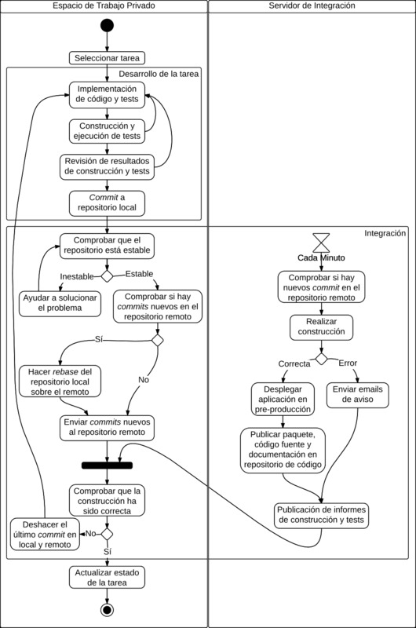
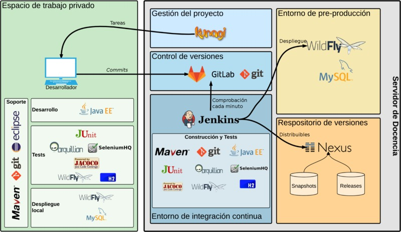

# ¿Cómo contribuir a este proyecto?

## Tabla de contenido
  * [1. Empezando](#1-empezando)
  * [2. Desarrollo de una tarea](#2-desarrollo-de-una-tarea)
  * [3. Estructura del proyecto](#3-estructura-del-proyecto)
  * [4. Entorno de desarrollo](#4-entorno-de-desarrollo)
  * [5. Configuración de un entorno de desarrollo](#5-configuración-de-un-entorno-de-desarrollo)
    * [5.1. MySQL](#51-mysql)
      * [5.1.1. Instalación con apt (Ubuntu)](#511-instalación-con-apt-ubuntu)
      * [5.1.2 Instalación con Docker](#512-instalación-con-docker)
    * [5.2. WildFly](#51-wildfly)
      * [5.2.1. Ejecución en un WildFly local](#511-ejecución-en-un-wildfly-local)
      * [5.2.2. Ejecución en un WildFly con Maven](#512-ejecución-en-un-wildfly-con-maven)
      * [5.2.3. Cambios que afecten a la configuración de WildFly](#513-cambios-que-afecten-a-la-configuración-de-wildfly)
  * [6. Control de versiones (Git)](#6-control-de-versiones-git)
    * [6.1. <em>Commits</em> con errores de construcción](#61-commits-con-errores-de-construcción)
    * [6.2. <em>Push</em> con <em>commits</em> nuevos en el servidor remoto](#62-push-con-commits-nuevos-en-el-servidor-remoto)
    * [6.3. Hacer <em>pull</em> ](#63-hacer-pull)
    * [6.4. <em>Pull</em> con cambios locales no <em>commiteados</em> ](#64-pull-con-cambios-locales-no-commiteados)
  * [7. Tests](#7-tests)
    * [7.1 Tests por módulo](#71-tests-por-módulo)
    * [7.2 El módulo tests](#72-el-módulo-test)
    * [7.3 Ejecución de los tests](#73-ejecución-de-los-tests)
      * [7.3.1 Ejecución de los tests en Maven](#731-ejecución-de-los-tests-en-maven)
      * [7.3.2 Ejecución de los tests en Eclipse](#732-ejecución-de-los-tests-en-eclipse)
    * [7.4 Análisis de los resultados de los tests](#74-análisis-de-los-resultados-de-los-tests)
  * [8. Guía de estilo](#8-guía-de-estilo)
    * [8.1. Código fuente](#81-código-fuente)
    * [8.2. Control de versiones](#82-control-de-versiones)
    * [8.3. Material adicional](#83-material-adicional)


## 1. Empezando

El proyecto μStories se desarrolla en un entorno de integración continua con
despliegue continuo en un servidor de pre-producción (*staging*). Este entorno
está compuesto por varias herramientas que automatizan el proceso, todas ellas
dirigidas por el POM de este proyecto.

En este documento encontrarás una descripción de este entorno y las
instrucciones para saber cómo contribuir correctamente a este proyecto.


## 2. Desarrollo de una tarea
El proceso habitual para realizar una tarea será, normalmente, el siguiente:

1. En **Kunagi** selecciona la tarea de la que seas responsable que deseas
desarrollar y lee bien la descripción de la misma.
2. Abre el entorno de desarrollo.
3. Verifica que te encuentras en la rama `develop`. Si no es así, cámbiate a
esta rama.
4. Haz *pull* de los últimos cambios (ver [sección 6](#6-control-de-versiones-git)).
5. Implementa la solución, incluyendo los tests (ver [sección 7](#7-tests)).
  1. Haz un *commit* con cada parte estable (completa y testeada) que

    desarrolles.
  2. Cada vez que hagas un *commit* envíalo al repositorio central **Gitlab**

    para compartirlo con el resto del equipo (ver
    [sección 6](#6-control-de-versiones-git)).
  3. Comprueba que la construcción funciona correctamente en el servidor de

    integración continua **Jenkins**.
  4. Si la construcción falla, sigue los pasos descritos en la

    [sección 6.3](#63-pull-con-cambios-locales-no-commiteados).
  5. Si la construcción es correcta, comprueba que el proyecto se ha desplegado

    y funciona correctamente en el servidor **WildFly** de pre-producción y que el
    repositorio Maven **Nexus** tiene una nueva versión del proyecto
    (ver [sección 4](#4-entorno-de-desarrollo)).
6. Cuando acabes la jornada de trabajo recuerda introducir las horas en la tarea
de **Kunagi**.

En el siguiente diagrama de flujo encontrarás una descripción más detallada de
este proceso, incluyendo el trabajo que realiza el servidor de integración
continua.



En las siguientes secciones encontrarás información que te ayudará a realizar
este trabajo.


## 3. Estructura del proyecto
Este proyecto está estructurado en 7 módulos:

* **tests**:
módulo que contiene utilidades para realizar los tests. Este módulo será
importado por el resto de módulos con el *scope* `test` para hacer uso de sus
utilidades.
* **domain**:
módulo que contiene las clases de dominio (entidades).
* **service**:
módulo que contiene los EJB del sistema, que serán utilizados tanto por la capa
JSF como por la capa REST. Además, será en esta capa en la que se harán los
controles de acceso.
* **rest**:
módulo que contiene una capa de servicios REST.
* **jsf**:
módulo que contiene la interfaz Web del sistema implementada con Java Server
Faces (JSF).
* **ear**:
módulo destinado, únicamente, a la construcción del EAR desplegable del
sistema.
* **additional-material**:
no es realmente un módulo del proyecto. Simplemente es un directorio
que acompaña al resto del proyecto en el que se almacenarán ficheros adicionales
que puedan resultar de utilidad. Algunos ejemplos de ficheros que pueden ir en
este directorio son plantillas HTML, ficheros de configuración del servidor
WildFly, ficheros para la creación y gestión de la base de datos, etc.


## 4. Entorno de desarrollo
Las herramientas que componen el entorno de integración continua son las
siguientes:

* **Maven 3**:
es un entorno de construcción de proyectos para Java. Esta será una herramienta
clave, ya que es quien dirigirá todo el proyecto. Es necesario que tengas
instalado Maven 3 en tu equipo de desarrollo para poder construir el proyecto.
* **Kunagi**:
es una herramienta de gestión de proyectos Scrum. En ella encontrarás toda la
información sobre las funcionalidades desarrolladas y por desarrollar, el
alcance de las publicaciones, el estado de desarrollo, etc. Puedes acceder a
través del siguiente [enlace](http://www.sing-group.org/dt/kunagi).
* **Git y Gitlab**:
Git es el sistema de control de versiones que se utiliza en el proyecto. Es un
sistema de control de versiones distribuido que facilita la colaboración entre
desarrolladores. Es necesario que tengas instalado Git en tu sistema para poder
realizar cambios en el proyecto y colaborar con el resto del equipo.
Por otro lado, Gitlab es un *front-end* del repositorio Git común. Esta
herramienta facilita la visualización de los *commits* y ficheros del proyecto,
además de proporcionar alguna otra funcionalidad que mejora la colaboración.
Puedes acceder a través del siguiente
[enlace](http://www.sing-group.org/dt/gitlab).
* **Jenkins**:
es un servidor de integración continua. Este servidor está configurado para
vigilar el repositorio Git y, ante cualquier cambio en la rama `develop`,
lanzar una construcción completa del sistema. Para cada construcción se
ejecutarán todos los tests incluidos y se generarán varios informes finales a
los que podrás acceder a través de la web. Además, si la construcción ha tenido
éxito, el sistema se desplegará en un WildFly de pre-producción (explicado más
adelante).
Si la construcción no ha tenido éxito, entonces se enviará un email de aviso a
todo el equipo de desarrollo y resolver esta situación se convertirá en la
mayor prioridad del equipo.
Puedes acceder a través del siguiente
[enlace](http://www.sing-group.org/dt/jenkins).
* **Nexus**:
  es un gestor de repositorios Maven. Lo utilizaremos para publicar el proyecto
  empaquetado en formato Maven. Puedes acceder a través del siguiente
  [enlace](http://www.sing-group.org/dt/nexus)
  Utilizaremos dos de los repositorios de este servidor:
  * `Snapshots`: en el que se publicarán las versiones de trabajo del proyecto.
  * `Releases`: en el que se publicarán las versiones publicables del proyecto.
* **WildFly de pre-producción**:
  en este contenedor se desplegará el sistema cada vez que una construcción se
  complete con éxito en Jenkins. Las URLs en las que se desplegarán las
  aplicaciones del proyecto son:
  * JSF: http://www.sing-group.org/microstories-2223-teamA/jsf
  * REST: http://www.sing-group.org/microstories-2223-teamA/rest
* **WildFly local**:
Aunque el proyecto está configurado para ser ejecutado directamente desde
Maven, también es posible desplegarlo en un servidor WildFly local. En la
[sección 5.1](#511-ejecución-en-un-wildfly-local) encontrarás una explicación
de cómo instalarlo y configurarlo.
* **MySQL 5+**:
es el sistema gestor de base de datos (SGDB) que utilizará el sistema
definitivo. En la explicación de cómo ejecutar el sistema en local utilizaremos
este SGBD, por lo que deberás tenerlo instalado en tu equipo.

En el siguiente diagrama se detallan las distintas secciones que componen el
entorno de desarrollo, junto con las distintas tecnologías y herramientas
empleadas en cada sección.



## 5. Configuración de un entorno de desarrollo
Empezar a trabajar en el proyecto es tan sencillo como seguir los siguientes
pasos:

1. Instala Git y Maven. Si estás en un entorno Ubuntu es tan sencillo como
ejecutar `sudo apt-get install git maven`. También es recomendable que instales
algún visor de Git como `gitk` o `qgit`.
2. Clona el repositorio Git utilizando el comando:
`git clone http://sing-group.org/dt/gitlab/dgss-2223-teamA/microstories.git`
3. Instala Eclipse for Java EE (opcional pero recomendado):
  1. Descarga el IDE desde https://www.eclipse.org/downloads/eclipse-packages/
  2. Importa el proyecto en Eclipse utilizando `Import...->Existing Maven
projects`, selecciona el directorio del proyecto en `Root directory` y marca
todos los proyectos que aparezcan.

En la [sección 7.3](#73-ejecución-de-los-tests-en-eclipse) aparece detallada la
configuración necesaria para ejecutar los tests desde Eclipse.

Con esto ya sería suficiente para poder empezar a trabajar en el proyecto. Si,
además, quieres poder ejecutarlo de forma local, deberás seguir las siguientes
instrucciones.

### 5.1 MySQL
Cuando se ejecute la aplicación en local se utilizará una base de datos MySQL
para almacenar los datos y que, de este modo, sean persistentes, tal y como
ocurriría en una ejecución real. Además, aunque los tests se ejecutan por
defecto utilizando una base de datos en memoria, también es posible ejecutarlos
utilizando una base de datos MySQL.

Este proyecto está configurado para funcionar con una base de datos MySQL 5+.
Dependiendo de la distribución que estés utilizando, la versión de MySQL que
se instalará podrá variar entre una 5+ o una 8+, por lo que, a continuación se
explicará como instalar MySQL utilizando `apt` y utilizando Docker, para así
poder aplicar el método que resulte más adecuado para cada situación.

#### 5.1.1 Instalación con apt (Ubuntu)
La instalación con `apt` es tan sencilla como hacer: `sudo apt install mysql`

Cuando ejecutes esto se mostrará información sobre la versión concreta de MySQL
que se instalará y podrás decidir si contiuar o no.

Puedes consultar otras alternativas ejecutando:
`sudo apt-cache search mysql-server`

Este comando te mostrará una lista de paquetes con `mysql-server` en su nombre,
con lo que podrás saber qué versiones están disponibles.

Una vez instalado MySQL debes importar la base de datos. En el directorio `db`
del proyecto `additional-material` están los  almacenados los *scripts* de
creación de la base de datos (inicialmente solo habrá uno). El *script*
`microstories-mysql.full.sql` contiene la creación completa de la base de
datos, incluyendo la creación del esquema y del usuario usado por la
aplicación. Por lo tanto, si estás en un sistema Ubuntu, puedes realizar la
importación desde la raíz del proyecto con el siguiente comando:
```bash
mysql -u root -p < additional-material/db/microstories-mysql.full.sql
```

Dependiendo de la versión de Ubuntu, es posible que, en lugar de este comando, debas ejecutar:

```bash
sudo mysql < additional-material/db/microstories-mysql.full.sql
```


#### 5.1.2 Instalación con Docker

En el caso de que no dispongas de una versión 5+ de MySQL para instalar, que ya
tengas una versión instalada o que prefieras no instalarla directamente en tu
equipo, podrás utilizar la instalación con Docker.

En primer lugar, deberás instalar Docker siguiendo los pasos del
[manual](https://docs.docker.com/get-docker/).

Una vez lo hayas instalado, podrás ejecutar un contenedor con MySQL 5.7
utilizando el siguiente comando: 
```
docker run -d --name microstories-mysql -e MYSQL_ROOT_PASSWORD=dgsspass -v $PWD/mysql:/var/lib/mysql -v $PWD/additional-material/db/microstories-mysql.full.sql:/docker-entrypoint-initdb.d/microstories-mysql.full.sql -p 3306:3306 mysql:5.7 --character-set-server=utf8mb4 --collation-server=utf8mb4_unicode_ci
```

Este comando creará un contenedor llamado `microstories-mysql` con un MySQL 5.7
y, además, se encargará de ejecutar el *script*
`additional-material/db/microstories-mysql.full.sql` durante el primer
arranque, con lo que no será necesario que lo importes manualmente.

Este contenedor almacenará la base de datos en el directorio `mysql` del
proyecto para que sea persistente y no se pierda si se elimina el contenedor.
El proyecto está configurado para que este directorio no se envíe al sistema de
control de versiones.

Podrás controlar el ciclo de vida de este contenedor con los siguientes comandos:
* Iniciar el contenedor (necesario al reiniciar el equipo):
`docker start microstories-mysql`
* Detener el contenedor:
`docker stop microstories-mysql`
* Acceder a MySQL como `root` (password: `dgsspass`):
`docker exec -it microstories-mysql mysql -uroot -p`
* Acceder a MySQL como `microstories` (usuario utilizado por la aplicación con password `microstoriespass`):
`docker exec -it microstories-mysql mysql -umicrostories -p microstoriespass`

### 5.2. WildFly
El proyecto está configurado y preparado para ser ejecutado en un servidor
WildFly 10.x (preferiblemente 10.1.0) o 8.x (preferiblemente 8.2.1). Sin
embargo, en el caso concreto de la ejecución de los tests y de la ejecución del
servidor directamente desde Maven, se utilizará la versión 10.1.0 de WildFly.

**Importante**: para evitar conflictos entre la ejecución de WildFly en los
tests y la ejecución del WildFly local o de pre-producción, estos primeros están
configurados para usar un *port-offset* de 20000. Esto significa que al número de
los puertos por defecto habrá que sumarles 20000. Por ejemplo, el puerto HTTP
será el puerto 28080 en lugar del 8080 habitual.

En cualquiera de las siguientes configuraciones, la aplicación estará disponible en:
  * JSF: http://localhost:8080/microstories-2223-teamA/jsf
  * REST: http://localhost:8080/microstories-2223-teamA/rest


#### 5.2.1. Ejecución en un WildFly local
La ejecución del proyecto en un WildFly local requiere la instalación del propio
servidor, de un SGBD MySQL y la configuración del servidor WildFly.

Por lo tanto, para configurar un WildFly local debes instala WildFly como
servidor local. Para ello, debes descargar una versión
compatible de http://wildfly.org/downloads/ y descomprimirla en un directorio
local.

A continuación, sustituye el fichero `standalone/configuration/standalone.xml`
por el fichero `standalone.xml` correspondiente de los disponibles en el
directorio del proyecto `additional-material/wildfly`.

Para finalizar, despliega el *driver* MySQL en el servidor WildFly. Puedes
descargar el *driver* manualmente desde el [repositorio de Maven](https://repo1.maven.org/maven2/mysql/mysql-connector-java/8.0.27/mysql-connector-java-8.0.27.jar).
Debes guardar este fichero en el directorio `standalone/deployments` del
servidor WildFly.

Con esto ya estaría configurado el WildFly local y ejecutarlo es tan sencillo
como invocar los siguientes comandos desde el directorio de WildFly:

```
[Linux] bin/standalone.sh
[Windows] bin\standalone.bat
```

Una vez arrancado el proyecto podemos desplegar el fichero EAR generado en el
módulo `ear` al realizar la construcción. Existen dos formas de hacer esto:
* **Opción A**: copiar el fichero EAR directamente al directorio
`standalone/deployments` del servidor WildFly. El servidor debería reconocer
inmediatamente la aplicación e iniciar el despliegue.
* **Opción B**: acceder a la interfaz de gestión del servidor, que debería
estar en http://localhost:29990, e irse al panel "Deployments". En este panel
tendremos la posibilidad de desplegar el fichero EAR.
Para poder realizar esta opción, es necesario añadir un usuario administrador
al servidor, para lo cual se debe invocar el siguiente comando desde el
directorio de WildFly:

```
[Linux] bin/add-user.sh
[Windows] bin\add-user.bat
```

#### 5.1.2. Ejecución en un WildFly con Maven
El POM de este proyecto se ha configurado para que sea posible construir y
ejecutar la aplicación sin más dependencia externa que la base de datos MySQL.

Para ello, debe haberse configurado la base de datos correctamente (ver punto
anterior) y ejecutar el comando Maven:

```bash
mvn install -P wildfly-mysql-run,-wildfly-embedded-h2
```

Para detener la ejecución debe utilizarse el comando:

```bash
mvn wildfly:shutdown
```

Adicionalmente, en el caso de querer redesplegar la aplicación, puede usarse el
comando:

```bash
mvn wildfly:shutdown install -P wildfly-mysql-run,-wildfly-embedded-h2
```

#### 5.1.3. Cambios que afecten a la configuración de WildFly
Los cambios en la configuración del servidor WildFly afectan en varios niveles
al proyecto.

Si, por ejemplo, queremos añadir algún elemento a la configuración de los
servidores WildFly (fichero `standalone.xml`), entonces este cambio afectará a:
* Configuración para los servidores locales que se almacena en
`additional-material/wildfly/v10.1.0/standalone.xml` y
`additional-material/wildfly/v8.2.1/standalone.xml`.
* Configuración de los servidores de test que se almacena en los directorios
`src/test/resources-wildfly-embedded-h2` y `src/test/resources-wildfly-embedded-mysql`.
* Configuración del servidor de pre-producción. **Nota**: En este caso será
necesario ponerse en contacto con el responsable del servidor.
* Puede afectar a este mismo documento.

Otro caso sería que fuese necesario desplegar algún artefacto adicional en el
servidor. En este caso el cambio afectaría a:
* **Servidor local**. Habría que desplegar este nuevo artefacto en él.
* **Servidores de test**. Es probable que solo sea necesario modificar el
fichero POM del proyecto padre para añadir el recurso del mismo modo que se
añade el *driver* de MySQL en el perfil `wildfly-embedded-mysql`.
* **Servidor de pre-producción**. En este caso será necesario ponerse en
contacto con el responsable del servidor.
* Puede afectar a este mismo documento.

## 6. Control de versiones (Git)
El modelo de control de versiones que utilizaremos inicialmente será muy
sencillo ya que solo utilizaremos dos ramas:

* `master`: a esta rama solo se enviarán los *commits* cuando se llegue a una
versión estable y publicable (una *release*). Estas versiones deberán estar
etiquetadas con el número de versión correspondiente.
* `develop`: esta será la rama principal de trabajo. Los *commits* que se envíen
deben ser estables, lo que supone que el código debe incluir tests y todos deben
superarse existosamente al construir la aplicación en local.
* `tmp-`: las ramas con el prefijo `tmp-` son ramas temporales. Cada pareja
  (*sprint* I) o desarrollador (*sprint* II) solo podrá tener una única rama
  temporal, que deberá eliminar de los repositorios local y remoto en el momento
  que ya no sean necesarias. Las ramas temporales siempre deben crearse desde la
  rama `develop`. La pareja o desarrollador propietarios de la rama podrán hacer
  `push` y `pull`, mientras que el resto solo podrán hacer `pull`. Este tipo de
  ramas admite cualquier tipo de *commit* (p.ej. código incompleto, código que no
  compila, código sin tests, etc.) y, por tanto, no serán controladas por el
  servidor de integración continua. Por último, el nombre de la rama debe ser:
  * `tmp-<pareja>`: donde `<pareja>` es el identificador de la pareja
  propietaria.
  * `tmp-<login>`: donde `<login>` es el *login* del usuario que la crea en el
  servidor Gitlab.

### 6.1. *Commits* con errores de construcción
Ambas ramas estarán controladas por el servidor de integración que ejecutará
los tests inmediatamente después de que se haga un *commit*. En el caso de que
una **construcción falle** en Jenkis es muy importante **deshacer el último
_commit_ para volver a un estado estable**.

Aunque existen varias formas de hacer esto, la forma más directa es:

```
git push origin +HEAD^:develop
```

Este comando fuerza a que la rama `develop` remota se sitúe en el *commit*
anterior a `HEAD`, ya que `HEAD` es el *commit* conflictivo. El *commit* seguirá
existiendo en local y se espera que tras corregir los errores se realice un
`git commit --amend`.
Si se desea descartar el *commit* local pero mantener el estado de los ficheros,
puede utilizarse un `git reset --mixed HEAD^`.

### 6.2. *Push* con *commits* nuevos en el servidor remoto
Si se desea hacer un *push* a un servidor remoto en el cual hay *commits* que
nuevos que no tenemos en local, entonces Git muestra un error en el que nos
indica que debemos hacer un *pull* antes de poder hacer *push*.

Dado que no nos interesa tener que añadir un *commit* de *merge* adicional,
el *pull* debe hacerse aplicando un *rebase*. Para ello debe usarse el comando:

```
git pull --rebase
```

Este comando iniciará un proceso de *rebase* entre desde la rama local hacia la
rama remota. Es decir, los *commit* locales no *pusheados* pasarán a tener como
padre el último *commit* remoto.

**Nota**: es muy recomendable configurar el proyecto para que siempre que se
haga un *pull* que traiga nuevos *commits* se haga un *rebase* en lugar de
*merge*. Es decir, para que se comporte como se ha descrito más arriba. Para
esto podemos modificar la configuración del proyecto de la siguiente manera:

```
git config pull.rebase true
```

Con esta configuración ya no tendríamos que añadir el modificador `--rebase` al
hacer *pull*.

### 6.3. Hacer *pull*
Antes de hacer un *pull* siempre se debe revisar el servidor de integración
continua. En el caso de que haya una construcción en ejecución **no debe hacerse
_pull_** hasta que finalice y se compruebe que ha sido con éxito.

En el caso de que la construcción falle, debe esperarse a que el repositorio
vuelva a un estado estable (ver [sección 6.1](#61-commits-con-errores-de-construcción))
antes de hacer *pull*.

### 6.4. *Pull* con cambios locales no *commiteados*
En caso de que nos encontremos en medio de un *commit* (no se ha completado los
cambios necesarios para realizar un *commit*) y deseemos descargar nuevos
*commits* del servidor central, podemos hacerlo utilizando los comandos:

```
git stash
git pull --rebase
git stash pop
```

## 7. Tests
Lo primero que se debe tener en cuenta a la hora de realizar tests es la
existencia del módulo `tests`. Este proyecto está pensado para recoger las
clases de utilidad que puedan ser compartidas por los tests de los distintos
módulos que forman el proyecto. Por lo tanto, siempre que exista una clase o
fichero que sea compartido por varios proyectos, debería almacenarse en este
módulo.

En segundo lugar, es importante ser consciente de que, dependiendo del módulo en
el que nos encontremos, deberemos hacer diferentes tipos de test.

Por último, como norma general, los métodos de prueba deben ser **lo más
sencillos posible**, de modo que sea sencillo comprender qué es lo que se está
evaluando. En base a esta regla, no añadiremos documentación Javadoc a los
métodos de prueba (esto no se aplica a las clases de utilidad del módulo
`tests`, que sí que deben estar documentadas con Javadoc).

A continuación se detalla el proceso de realización de tests.

### 7.1 Tests por módulo
Los tests que se deben hacer varían según el módulo en el que nos encontremos.
En concreto, los tests que habrá que hacer serán los siguientes:

* `domain`: tests de unidad para probar las entidades. Solo se testearán los
constructores y los métodos con una cierta lógica, como pueden ser los métodos
de las relaciones (p.ej. `getOnwer()`, `getPets()`, etc.). No será necesario
testear los constructores vacíos definidos para JPA.
* `service`: tests de integración con Arquillian y la extensión Persistence.
Además de la lógica, deben testear la seguridad.
* `rest`: tests de integración con Arquillian y las extensiones Persistence y
REST Client. **Opcionalmente**, pueden hacerse los tests de unidad con
EasyMock.
* `jsf`: no es obligatorio hacer ningún tipo de tests. **Opcionalmente**,
pueden hacerse tests funcionales con Arquillian y las extensiones Persistence,
Drone y Graphene 2.

### 7.2 El módulo tests
En el módulo `tests` se añadirán varias utilidades para realizar los tests,
entre las que encontraremos, principalmente, tres tipos distintos:

* **_Test Doubles_**: clases que sustituyan a otras implementando una lógica que
sea útil para los tests. Por ejemplo, la clase `TestPrincipal` permite sustituir
el `Principal` de la aplicación para poder modificar el usuario que ejecuta los
tests.
* **Clases `Datasets`**: estas clases representan un conjunto de datos de
pruebas. Contienen métodos para obtener a entidades que resultan de utilidad en
los tests. Estas clases deben ubicarse en el mismo paquete que las entidades que
contienen. El contenido de estas clases debe ser equivalente al contenido de los
*datasets* de DBUnit que se describe a continuación.
* **_Datasets_ DBUnit**: los `datasets` DBUnit son representaciones en forma de
XML de conjuntos de datos usados en los tests y pueden ser utilizados
directamente por Arquillian con las anotaciones `@UsingDataSet` y
`@ShouldMatchDataSet`. El contenido de estos ficheros debe ser el equivalente al
de las clases *dataset*. Estos ficheros deben almacenarse en el directorio
`src/main/resources/datasets`.
* **_Matchers_ Hamcrest para entidades**: cada entidad debería tener un
*matcher* de Hamcrest que permita compararla con otras entidades. Para facilitar
el desarrollo de estos *matchers* se incluye la clase `IsEqualsToEntity`, que
actúa como clase base para comparar dos entidades por sus propiedades.

### 7.3 Ejecución de los tests
#### 7.3.1 Ejecución de los tests en Maven
Este proyecto está configurado para ejecutar, únicamente, los tests de aquellas
clases cuyo nombre acabe en `TestSuite`. La intención es que estas clases sean
*suites* de tests que agrupen los casos de prueba del proyecto. Por lo tanto,
**es importante que todos los casos de prueba que se deseen ejecutar en el
proyecto estén asociados a una _suite_ de pruebas**.

Todos los tests del proyecto están configurados para ser ejecutados como tests
normales y no como tests de integración. Esto significa que se pueden lanzar
todos simplemente ejecutando el comando:

```
mvn test
```

#### 7.3.2 Ejecución de los tests en Eclipse
La ejecución de los test con Arquillian desde Eclipse, necesita de una pequeña
configuración adicional en las configuraciones de ejecución para que incluyan
los siguientes parámetros como propiedades del sistema:

```
-Darquillian.launch=wildfly-embedded
-Dwildfly.version=10.1.0.Final
-Dwildfly.jbossHome=target/wildfly-10.1.0.Final
-Dwildfly.modulePath=target/wildfly-10.1.0.Final/modules
-Djava.util.logging.manager=org.jboss.logmanager.LogManager
-Djboss.socket.binding.port-offset=20000
-Dwildfly.http.port=28080
-Dwildfly.management.port=29990
```

Si, además, queremos ejecutar los tests utilizando el perfil de MySQL, debemos
añadir las propiedades del sistema:

```
-Dmysql.version=8.0.27
-Darquillian.launch=wildfly-embedded-mysql
```

Por último, aunque los tests para el módulo JSF están desactivados por defecto,
si se desean utilizar serán necesario descargar el *driver* Gecko
([enlace](https://github.com/mozilla/geckodriver/releases)) y añadir el siguiente parámetro con el que se indica la ubicación del mismo en el sistema:

```
-Dwebdriver.gecko.driver=<ruta al driver nativo>
```

Estos parámetros pueden establecerse en el diálogo `Run->Run Configurations...`,
donde seleccionaremos la configuración de ejecución o crearemos una nueva. En
el panel de configuración de la configuración de ejecución debemos seleccionar
la pestaña `Arguments` e introducir estos parámetros en el campo `VM Arguments`.

### 7.4 Análisis de los resultados de los tests
Cada vez que se ejecutan los tests se generarán varios ficheros con información
sobre los resultados. Concretamente, se generarán dos tipos de informes:
* **JUnit**: genera informes sobre el éxito o fracaso de los tests. Estos informes
se almacenan en `<module>/target/surefire-reports`. Son ficheros XML que pueden
abrirse con Eclipse.
* **JaCoCo**: genera informes sobre la cobertura de los tests. Estos informes se
almacenan en `<module>/target/site/jacoco/index.html`.

Si realizamos la ejecución desde Eclipse, la misma información que muestran los
informes de JUnit nos aparecerá directamente en la vista de JUnit.

## 8. Guía de estilo
Un elemento importante para poder colaborar es que exista una uniformidad en el
código y otros elementos que forman parte del desarrollo. Esta sección sirve
como una pequeña guía de estilo que debe respetarse al trabajar en el proyecto.

### 8.1. Código fuente
Para uniformizar el código fuente deben respetarse las siguientes normas:
* **Idioma**: todo el código (incluyendo la documentación) debe desarrollarse en
inglés.
* **Formato de código**: el código debe estar formateado, preferiblemente,
siguiendo la [Guía de Estilo para Java de Google](https://google.github.io/styleguide/javaguide.html)
o, al menos, utilizando el formato de código de Eclipse (`Ctrl`+`Mayus`+`F`).
* **Comentarios**: debe evitarse **completamente** el código comentado y, en la
medida de lo posible, los comentarios en el código.
* **Documentación**: todas las clases deben incluir documentación Javadoc que
describa las responsabilidades de la misma. No es obligatorio documentar los
métodos. Se recomienda que se verifique que la documentación es
correcta utilizando el comando `mvn javadoc:javadoc`. Este comando generará la
documentación en formato HTML y fallará si encuentra algún error en la
documentación.

### 8.2. Control de versiones
Una de las bases de desarrollo que utilizaremos en este proyecto es el
**integrar tan pronto como se pueda**. Para ello, deben seguirse las siguientes
normas:

* **Contenido de los _commits_**: los *commits* deben ser completos en el
sentido de que no deben romper la construcción. Además, el código debe estar
probado, incluyendo los tests descritos en la [sección 7](#7-tests), para que el
resto de desarrolladores puedan confiar en el código. Es muy recomendable
revisar los informes de tests y de cobertura antes de hacer un *commit*.
* **Formato**: el formato de los *commits* deberá respetar las siguientes
  normas:
  * Escritos en inglés.
  * Limitar el tamaño de línea a 80 columnas. Si se utiliza Eclipse, esto se
  hace de forma automática.
  * Primera línea descriptiva de lo que hace el *commit*:
    * Si está relacionado con alguna tarea concreta de las descritas en Kunagi,
    debe comenzar con el identificador de la tarea (p.ej. "tsk1 Adds...").
    * Si está relacionado con varias tareas, su número se separará con un guión
    (p.ej. "tsk1-2-13 Fixes...").
    * Debe estar redactada en tercera persona del presente (p.ej. *Adds...*,
      *Improves...*, *Modifies...*, etc.).
    * No debe llevar punto al final.
  * Cuerpo del *commit* descriptivo. Con una línea vacía de separación de la
  primera línea, debe escribirse un texto de explique claramente el trabajo
  hecho en el *commit*.
* **Frecuencia de _commit_**: los *commits* deben hacerse en pequeños pasos para
que la frecuencia sea alta. Para ello es recomendable desarrollar de una forma
ordenada, atacando partes concretas. Se espera que cada desarrollador genere,
al menos, 2-3 *commits* cada semana. Además, deberán estar distribuidos a lo
largo de toda la semana, evitando, especialmente, realizar todos los *commits*
al final de la semana, pues esto afectaría a la integración continua.
* **Frecuencia de _push_**: siempre que se haga un *commit* debe hacerse un
*push*. La única excepción a esta regla es que estemos haciendo pruebas locales
para evaluar una posible solución. En tal caso, es recomendable que esto se
haga en una rama independiente para evitar enviar *commits* accidentalmente a
la rama *develop* remota.

### 8.3. Material adicional
El proyecto incluye un módulo `additional-material` cuya función es recoger
ficheros adicionales que no forman parte de los desplegables, pero que son
necesarios para el funcionamiento de la aplicación o pueden ayudar en el
desarrollo.

Por lo tanto, el contenido de este módulo debe actualizarse cuando corresponda
durante el desarrollo. En concreto, las dos situaciones en las que se debe
actualiar son:
  * **Creación de una nueva entidad**: cuando se crear una nueva entidad en el
    módulo de dominio será necesario actualizar el contenido del subdirectorio
    `db`. Este subdirectorio debe contener los ficheros:
    * `microstories-mysql.full.sql`: este fichero debe contener las consultas
    para crear la base de datos y sus tablas, crear el usuario necesario
    para la aplicación con los permisos correspondientes y añadir datos de
    ejemplo para poder probar la aplicación. Es decir, un administrador que
    instale la aplicación debería poder, simplemente, ejecutando este *script*
    en un SGBD MySQL, empezar a probar la aplicación.
    * `microstories-mysql.creation.sql`: este fichero debe contener las
    consultas para crear la base de datos y sus tablas.
    * `microstories-mysql.data.sql`: este fichero debe contener las consultas
    para añadir datos de ejemplo para poder probar la aplicación.
    * `microstories-mysql.delete.sql`: este fichero debe contener las consultas
    para eliminar todos los datos de las tablas de la base de datos y resetear
    los contadores autoincrementales.
    * `microstories-mysql.drop.sql`: este fichero debe contener las consultas
    para eliminar todas las tablas de la base de datos.
  * **Cambio en la configuración de WildFly**: en el caso de añadir algún cambio
    en la configuración del servidor que sea necesario para la ejecución de la
    aplicación (p.ej. configurar un servidor de correo), deberán actualizarse los
    ficheros de configuración de WildFly del subdirectorio `wildfly`. En concreto,
    un administrador que instale la aplicación, debe poder copiar el fichero de
    configuración correspondiente a su servidor y arrancarla sin problemas,
    habiendo configurado la base de datos previamente.
